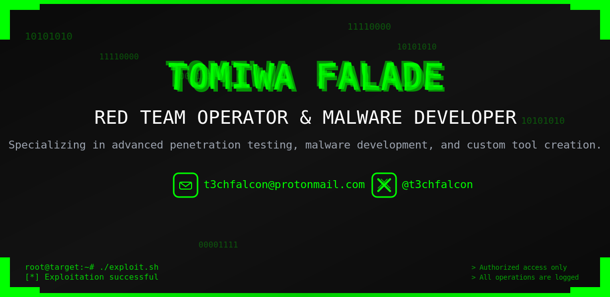

  

  

- 🔭 I’m currently working on [Offsec Radar](https://offsec-radar.vercel.app/)

- 🌱 I’m currently learning **anything/everything about Offensive Security**

- 💬 Ask me about **Malware Development, Red Teaming, Cybersecurity?**

- 📫 How to reach me **on X @t3chfalcon**

- ⚡ Fun fact **I know stuff**

<h3 align="left">Connect with me:</h3>

<h3 align="left">Languages and Tools:</h3>

       

<h3 align="left">Some of my Articles:</h3>
<a target="_blank" href="https://github-readme-medium-recent-article.vercel.app/medium/@t3chfalcon/0"> 
<a target="_blank" href="https://github-readme-medium-recent-article.vercel.app/medium/@t3chfalcon/2"> 

